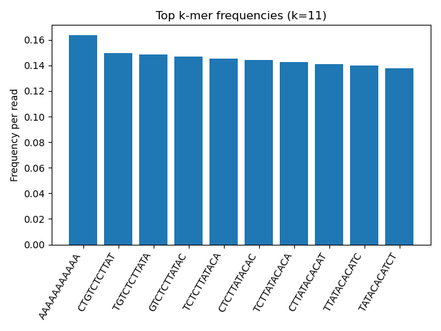

# microbial-genomics-rs  
A Rust-based approach to scalable processing of microbial sequencing data

## Overview

This repository implements a Rust-based approach for processing microbial sequencing data, with a focus on efficient streaming of FASTQ files, k-mer profiling, and detection of low-complexity sequence patterns.

The work is motivated by challenges in large-scale microbial genomics and emerging single-cell sequencing approaches, where data volumes are substantial and computational efficiency becomes critical.

This implementation demonstrates how k-mer-based representations can capture both sequence composition and structured patterns in microbial sequencing data.

## Features

- Streaming FASTQ processing (memory-efficient)
- GC content estimation
- k-mer counting with configurable k
- Identification of overrepresented k-mers
- Detection of low-complexity sequence patterns (e.g. homopolymers)
- JSON report generation for downstream analysis
- CSV export of top k-mers with normalized frequency
- Chunk-based parallel k-mer counting using Rayon
- De Bruijn graph summary derived from k-mer transitions
- Snakemake workflow integration

## Dataset

The analysis uses a subset of a publicly available Illumina sequencing dataset of *Escherichia coli*.

To keep the repository lightweight, a subset of approximately 100,000 reads is used.

### Data preparation

```bash
mkdir -p data/raw data/subset

curl -L -o data/raw/ecoli_R1.fastq.gz \
https://ftp.sra.ebi.ac.uk/vol1/fastq/SRR258/001/SRR2584861/SRR2584861_1.fastq.gz

gunzip -c data/raw/ecoli_R1.fastq.gz | head -n 400000 > data/subset/ecoli_100k_R1.fastq
```

## Usage

### Run the Rust tool

```bash
cargo run --release -- data/subset/ecoli_100k_R1.fastq 11 results/ecoli_k11_report.json results/top_kmers_k11.csv
```

### Run via Snakemake

snakemake -s workflow/Snakefile --cores 1

## Output

The workflow produces:

- JSON report containing:
  - number of reads  
  - GC content  
  - number of unique k-mers  
  - top k-mers with low-complexity annotation  
  - De Bruijn graph summary (node count, weighted edge count, average out-degree)  

- CSV table:
  - `results/top_kmers_k11.csv`  
  - contains k-mer, count, normalized frequency, and low-complexity flag  

## Example Visualization

Top k-mer frequencies (k = 11):



## Data Interpretation

The observed GC content is consistent with bacterial genomes such as *E. coli*.

Highly abundant k-mers may include homopolymeric sequences, which are flagged as low-complexity and can reflect sequencing bias or low-complexity genomic regions.

Other high-frequency k-mers form overlapping sequence patterns (e.g. CTGTCTCTTAT → TGTCTCTTATA), indicating that they originate from highly represented genomic regions. This demonstrates that k-mer frequency profiles capture structured sequence signals.

The graph summary represents k-mers as directed transitions between (k−1)-mers. Edge counts are weighted by k-mer abundance, reflecting the total number of observed transitions rather than only unique graph edges.

## Motivation

Modern microbial genomics and single-cell sequencing generate large volumes of data that require efficient and scalable processing.

This work explores how Rust can be used to build high-performance tools for:

- sequence processing  
- k-mer-based analysis  
- scalable bioinformatics workflows  

## Extensions

The current implementation focuses on streaming FASTQ processing, k-mer-based summarisation, parallel execution, and graph-based summarisation.

- construction of full graph representations (e.g. explicit de Bruijn graph structures)  
- compression and indexing of k-mer space  
- extension to single-cell and metagenomic sequencing data  